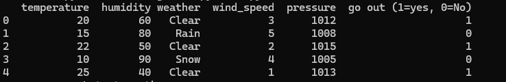
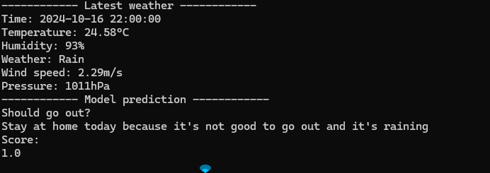

# SHOULD GO OUT?

A simple machine learning model to predict whether to go outside or not, based on the weather API at the current location. 
This repository is for my learning!

API: [OpenWeatherMap](https://openweathermap.org/api)

Dataset:

response:
